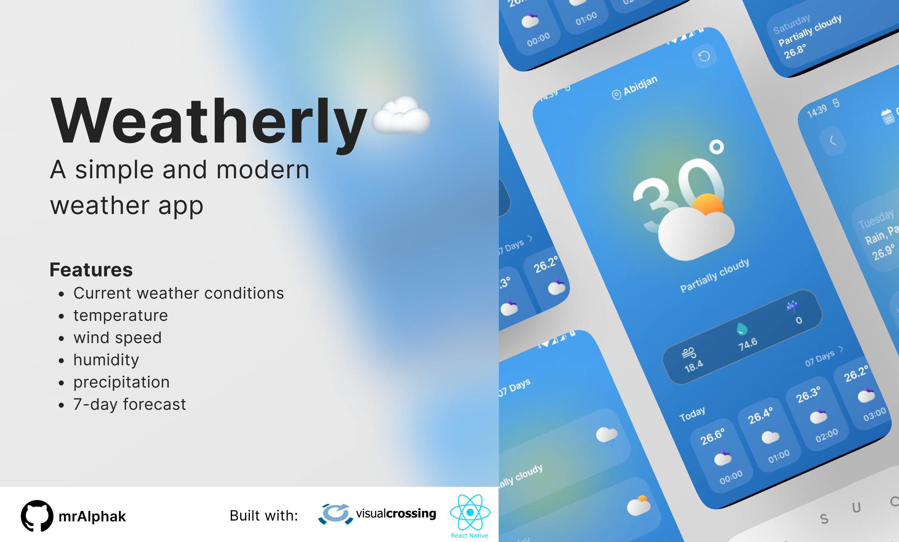

# Weatherly, a weather app ☁️🌞

This is a weather app built with React Native. 
It provides real-time weather information for current location. 

# Features:
- Current weather conditions, 
- temperature, 
- wind speed, 
- humidity 
- precipitation
- 7-day forecast

The app utilizes various libraries and components such as React Navigation
Feel free to modify and enhance the app according to your needs!

# Prerequisites:
- Node.js: Visit the official Node.js website and follow the instructions to install the latest LTS version of Node.js.
- NPM (Node Package Manager): NPM is automatically installed with Node.js.
- Xcode (for macOS) or Android Studio (for Windows/Linux): Depending on your target platform

# Installation Steps:
- Clone the repository
- Install dependencies: Run `npm install` into the cloned repository directory
- For ios users: Run `pod install`
- Start the development server: `npm run start` into the cloned repository directory
- Build and run the app: `npm run android` or `npm run ios`

Enjoy coding^^
